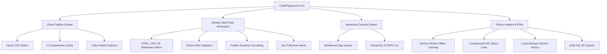

# CodePlayground - Premium Online IDE Playground (v2.0)

A state-of-the-art, feature-rich, and 100% offline-first web development playground for HTML, CSS, JavaScript, and Markdown. Built completely with vanilla web technologies, CodePlayground offers an ultra-premium visual IDE experience with an integrated sandboxed console, dynamic CSS generators, auto-formatting, serverless sharing, and Progressive Web App (PWA) installation capabilities.

[](https://github.com/KISHAN652/online-code-editor)
[](#-progressive-web-app-pwa)
[](LICENSE)

---

## 📖 About CodePlayground IDE

**CodePlayground v2.0** is an interactive browser-based development workbench designed for rapid prototyping, visual coding, and front-end learning. It moves far beyond standard online compilers by embedding advanced developer tools directly into a cohesive, glassmorphic client-side interface. 

With zero backend dependencies, the entire environment operates fully in the browser—meaning maximum security, extreme speed, and complete offline capability.

---

## 💎 Features Blueprint



---

## ✨ Features Breakdown

### 1. Collapsible Visual Sidebar Drawer
* **Visual CSS Sliders**: Real-time graphical range calculators for **Box Shadows**, **Border Radius**, and **Linear Gradients**. Design visually and click to inject the resulting CSS code instantly at your active cursor.
* **Component Library Tab**: Click to inject pre-coded, highly polished visual elements (Glassmorphic buttons, glowing inputs, neon cards, skeletal loader wrappers, iOS-style toggle sliders) directly into your active workspace.
* **Curated HSL Color Palettes**: Explore trending design palettes (Cyberpunk glow, pastel dreams, sunset breeze) and inject HEX color codes into your style sheets with a single click.
* **Cheat Sheets Tab**: Rapid reference syntax guides for CSS Flexbox, Grid, semantic HTML5 tags, and essential ES6 array helpers.

### 2. Smart Multi-Pane Workspace
* **Four Editor Columns**: Dedicated panels for **HTML5**, **CSS3**, **ES6 JavaScript**, and **README Markdown** (which compiles and renders notes dynamically in the preview shell).
* **Smart Caret Autoclose**: Automates matching brackets (`()`, `{}`, `[]`) and quotes (`""`, `''`, `<>`) closures with precise caret alignment.
* **Prettier Formatting integration**: Asynchronously fetches Prettier standalone parsers via CDN to clean and format active scripts on demand.
* **Real-time Code Linters**: Client-side warnings for unclosed tags, unclosed braces, or missing HTML `alt` image attributes. Shows pulsing red notification dots on tabs.
* **Zen Focus Mode**: Double-click any editor header to maximize it to full screen for distraction-free coding.
* **Workspace layout Engine**: Switch between horizontal split (editor columns stacked above the viewport) and vertical split (side-by-side editors and viewport) smoothly.

### 3. Sandboxed Live Preview & JS REPL Console
* **Log Interceptor**: Catch and filter all logs, warnings, and errors dispatched inside the sandboxed iframe and display them inside a gorgeous logs drawer.
* **Dynamic JS REPL Command Line**: Type active JavaScript expressions directly inside the console prompt and evaluate them inside the iframe sandbox context in real-time.
* **Environment Mock Data helper**: Access `playground.mockData` directly inside your scripts to query high fidelity fake user objects, product lists, or Unsplash technology category imagery.

### 4. Advanced Persistence, Sharing & Exports
* **Offline PWA Engine**: Bundles an aggressive Service Worker (`sw.js`) and PWA `manifest.json`. You can install CodePlayground on your phone or desktop and write/test code 100% offline.
* **Compressed URL Sharing**: Serializes and compresses your HTML, CSS, JS, and Markdown codes into a single URL-safe Base64 hash. Generate shareable links that open and restore your workspace instantly on any device without database roundtrips.
* **Local backups version history**: Automatically saves code checkpoints inside `localStorage` every 5 minutes. Roll back to any of the last 10 versions anytime using the Backups drawer.
* **Dynamic Library Manager**: Instantly inject popular libraries (Tailwind CSS, GSAP Animations, Font Awesome Icons, Animate.css, Bootstrap, jQuery) via dynamic script injection.
* **Project ZIP Exports**: Pack and download your entire workspace as a standalone structured ZIP folder containing separate `index.html`, `style.css`, and `script.js` files using `JSZip`.

---

## 📂 Project Structure

```
/online-code-editor
 ├── index.html          # Upgraded Visual IDE HTML framework
 ├── style.css           # CURATED light/dark glassmorphic variables & animation styles
 ├── script.js           # Visual calculators, REPL, linters, PWA and compression core
 ├── sw.js               # Service Worker caching for offline capability
 ├── manifest.json       # Progressive Web App configuration properties
 └── README.md           # This project guide
```

---

## 🚀 Setup & Installation

CodePlayground is zero-install and works out-of-the-box. Simply open `index.html` in any modern web browser or clone the repository to run it locally:

```bash
# Clone the repository
git clone https://github.com/KISHAN652/online-code-editor.git

# Enter the workspace directory
cd online-code-editor

# Open in browser (Windows)
start index.html

# Open in browser (macOS)
open index.html
```

---

## ⌨️ Keyboard Shortcuts

| Shortcut | Description |
|----------|-------------|
| `Ctrl + Enter` / `Cmd + Enter` | Run/Re-compile current playground codes |
| `Ctrl + S` / `Cmd + S` | Force-lock active code changes into localStorage |
| `Ctrl + \`` (Backtick) | Expand or collapse the console logs drawer |
| `Tab` | Insert 2-space code indentation |

---

## 📄 License

This project is licensed under the MIT License. Feel free to customize and expand it as you see fit!

---

**Developed with ❤️ by Kishan. Build something awesome on CodePlayground! 🚀**
